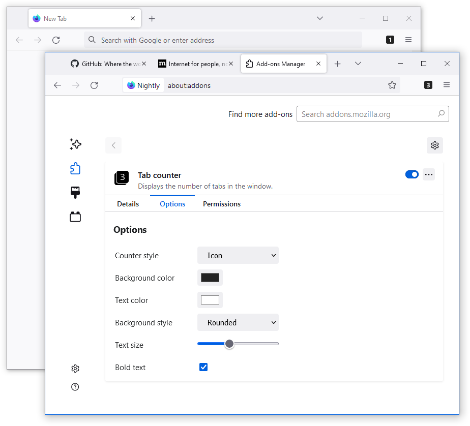

# Tab Counter 
Displays the number of tabs in the window.

## Screenshot

## Requirements
- Firefox 57+

## Permissions
- Tabs
- Storage
- Context Menu

## Download
https://addons.mozilla.org/firefox/addon/tabcounter-1?src=external-github
