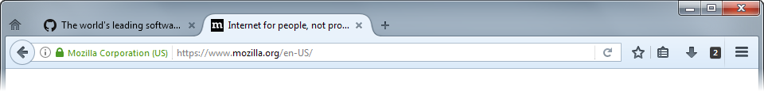

# Tab Counter 
Displays the number of tabs in the active window.

## Screenshot

## Requirements
- Firefox 45+

## Permissions
- Tabs
- Storage
- Context Menu

## Download
https://addons.mozilla.org/en-us/firefox/addon/tabcounter-1/
